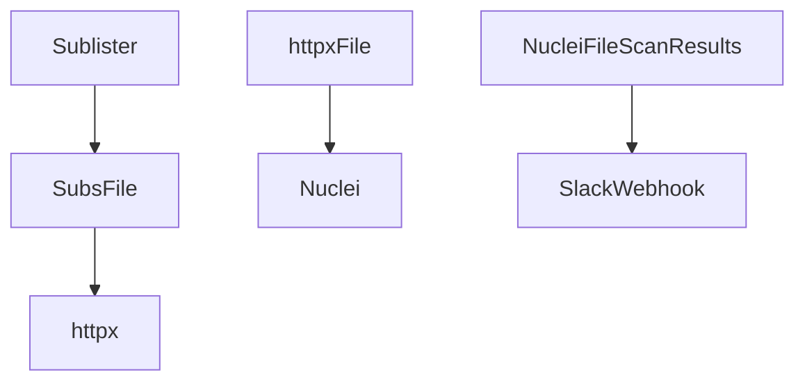
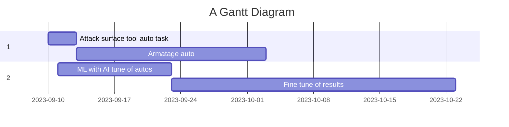

# red-infra
red teaming infra and automations

Used for automated testing appsec tests and reporting.







```
go install -v github.com/projectdiscovery/nuclei/v2/cmd/nuclei@latest
go install -v github.com/projectdiscovery/httpx/cmd/httpx@latest
go install -v github.com/projectdiscovery/subfinder/v2/cmd/subfinder@latest
```